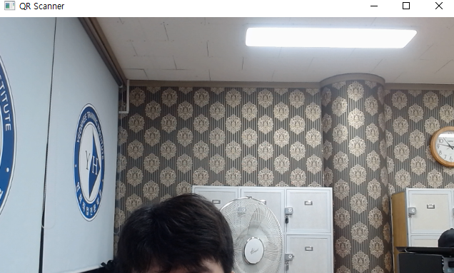
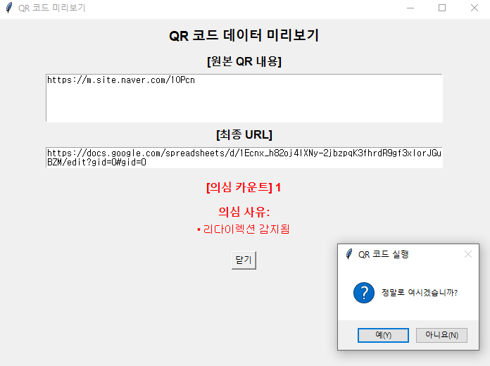
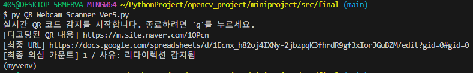

# QR코드 및 도메인 스캔 프로그램

## 소개
이 프로그램은 QR코드를 스캔 시, 
악성 QR코드나 링크를 감지하여 사전에 차단해주고 
정상 QR코드는 문제 없이 실행시켜주는 프로그램이다.  

QR코드에서 피싱과 악성코드를 예방할 수 있다.

---

## 프로젝트 루트
   -  docs - 문제점 및 피드백에 관한 내용
   -  src - 프로젝트를 진행하며 만들어온 알고리즘들
```
프로젝트 루트
┣ docs
┃ ┗ feedback
┃ ┣ 01-problem.md
┃ ┣ 02-problem.md
┃ ┣ 0814.md
┃ ┣ 0818.md
┃ ┣ 0819.md
┃ ┗ 0820.md
┣ src
┃ ┣ final
┃ ┃ ┗ QR_Webcam_Scanner_Ver5.py
┃ ┣ prototypes
┃ ┃ ┣ QR_Domain_Scanner.py
┃ ┃ ┣ Scam_scanner.py
┃ ┃ ┗ scan_noopencv.py
┃ ┗ tests
┃ ┣ QR_Webcam_Scanner.py
┃ ┣ QR_Webcam_Scanner_Ver2.py
┃ ┣ QR_Webcam_Scanner_Ver3.py
┃ ┗ QR_Webcam_Scanner_Ver4.py
┣ .gitattributes
┗ README.md
```

## 보안 위협 상황
QR코드를 스캔해야 하는 상황에,
(예시: 전동킥보드를 탈 때, 길가에 있는 QR코드를 스캔할 때 등)
QR코드로 위장한 악성 URL로 인해 피해자가 발생하는 경우가 있음.

- **QR코드**: 악성코드 배포 수단으로 활용이 가능함.

---

## 피해 사례 및 분석

### 국내 사례
1. QR코드 기반 피싱(Quishing) 증가

개요: 최근 한국에서 QR코드를 이용한 피싱 공격이 급증하고 있습니다. 
이는 QR코드가 사용자에게 친숙하고 신뢰를 주기 때문에 악성 사이트로 유도하기에 용이하기 때문입니다.

통계: SK쉴더스의 2023년 보안 위협 전망 보고서에 따르면, QR코드 기반 피싱 사건은 전년 대비 60% 증가하였으며, 
전체 보안 사고 중 18.6%를 차지하고 있습니다.

### 해외 사례
2. 영국 주차장에서의 QR코드 사기

개요: 영국에서 주차 기계에 부착된 가짜 QR코드를 스캔한 피해자가 £100 이상을 사기당한 사례가 보고되었습니다.

방법: 가짜 QR코드는 합법적인 주차 결제 사이트처럼 보이도록 설계되어, 
사용자가 은행 정보를 입력하도록 유도하였습니다.

3. 미국에서의 'Brushing' 사기

개요: 미국에서는 발신자가 없는 소포에 QR코드를 포함시켜 수취인이 이를 스캔하도록 유도하는
'Brushing' 사기가 발생하고 있습니다.

목적: 수취인이 QR코드를 스캔하면 개인정보를 입력하거나 악성 소프트웨어를 다운로드하게 되어,
판매자의 평점을 인위적으로 높이는 데 사용됩니다.

---

## 프로그램 구조 및 기능

### 초대 링크 스캐너 (Python)
- OpenCV를 통해 이미지 분석
- QR코드에 있는 URL 링크 확인
- 위험 조건 체크리스트를 만들어, 해당 조건에 2가지 이상 해당될 시, 의심 상황으로 간주.  
- 의심 상황 발생시 경고 발송 + 실행 차단

### 시연 사진
#### 시작 단계
- 해당 화면에 QR코드를 갖다 대면, QR코드를 인식합니다.
- 


#### QR코드를 인식했을 때
- 결과 화면 UI를 생성. 실행 여부를 묻는 창에서 '예'를 누르면, 해당 URL을 실행시키고, '아니오'를 누르면 종료합니다.
- 원본 URL 내용, 최종 URL, 의심 카운트 및 사유를 다른 UI창에 표기하여 알려줍니다.
- 


#### 터미널 콘솔
- 인식한 QR코드를 바탕으로 디코딩된 URL, 최종 URL, 의심 카운트 및 사유를 콘솔에 표시합니다. 
- 


---

## 활용 방법 - 위험 상황 예상 및 분석
1. 짧은 URL 서비스 사용
   - 예시: "bit.ly", "tinyurl.com", "t.co", "goo.gl"
2. 위험 확장자 포함
   - 예시: ".exe", ".apk", ".bat", ".sh"
3. IP 주소 기반 URL
   - 예시: 192.153.225.61 
4. URL 길이가 지나치게 길 경우
   - 조건: URL의 길이가 200자 이상이면 의심.
5. 자바스크립트 실행 코드 포함
6. Base64 인코딩된 긴 문자열.
   - This is a long string to be Base64 encoded.를 Base64로 인코딩하면,
   - VGhpcyBpcyBhIGxvbmcgc3RyaW5nIHRvIGJlIEJhc2U2NCBlbmNvZGVkLg== 이 됨. (알아볼 수 없음)
   -  해당 방식으로 우회를 시도하거나 일회성 URL을 제작하여 악용될 여지가 있음.
7. 리다이렉션이 감지될 경우.
   - 예시: 네이버에서 QR코드를 제작 시, 기존의 URL을 변형시켜 URL 검사망이 뚫릴 수 있는 리다이렉션이 사용됨.
   
   위 조건들 중, 2가지 이상 해당될 경우, 
   QR코드 실행을 차단하는 방식으로 코드를 제작.

---

## 프로그램 제작 과정
0. 사전에 설치해야 할 것(필수 라이브러리)
   - Python: Python 3.8 이상을 권장합니다.
```
pip install opencv-python
pip install pillow
pip install numpy
pip install requests
```

1. 프로토타입 제작 
   - QR코드를 탐지할 수 있는 프로그램
   - 해당 프로토타입은 QR코드 탐지만 가능한 모델로, 개선이 많이 필요함.

2. ver.1 제작 : 프로토타입의 다음 버전
   - 해당 알고리즘을 제작할 때, OpenCV 내부에서 경고문이 너무 많이 출력되는 문제가 발생.
   → 이를 stderr 무력화를 통해 해결함.

3. ver.2 제작 : 실행여부 UI, QR코드 URL 팝업
   - 사용자에게 실행여부를 묻고 실행 시, QR코드의 URL 열기
   - 디코딩된 QR 내용을 콘솔에 표시.
   - 팝업창: tkinter 활용.

4. ver.3 제작 : 악성 QR 탐지, 야간 환경 개선
   - 본격적으로 악성 QR코드 탐지 함수를 추가: 악성 QR의 대표적인 예시들을 종합하여 (예: URL의 길이가 너무 길거나 짧음, 위험한 확장자를 포함하고 있음 등) 조건을 완성.
   - 해당 조건 중, 2가지 이상에 해당하면 악성 QR로 간주함.
   - 야간 모드 추가 - 어두운 환경에서 QR을 스캔할 때
   인식률이 떨어지는 것을 방지.

5. ver.4 제작: 리다이렉션 추적 모듈 추가
   - QR코드의 URL이 리다이렉션된 경우, 본래의 URL을 숨기고
   이전의 탐지 조건을 생략하고 실행되는 상황 발생. 이를 해결하고자 추적 모듈 requests를 추가 및 적용.

6. ver.5 제작: 최종본. 미리보기 GUI 추가.
   - 미리보기 GUI에 URL, 악성QR 의심 사유 및 카운트 수 표기.
      해당 창에 QR코드에 대한 정보를 표기함.
   - 해당 미리보기 창은, URL을 실행시키지 않음. → 안전함.
   